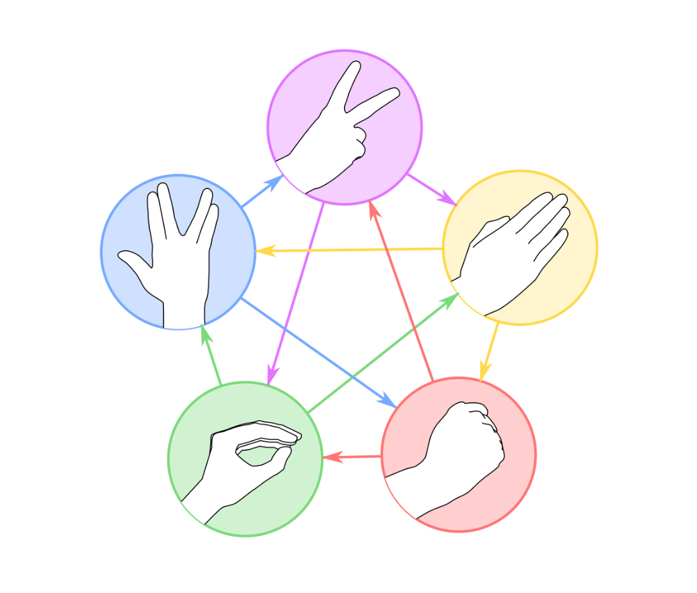

Правила игры стандартные: ножницы режут бумагу. Бумага заворачивает камень. Камень давит ящерицу, а ящерица травит Спока, в то время как Спок ломает ножницы, которые, в свою очередь, отрезают голову ящерице, которая ест бумагу, на которой улики против Спока. Спок испаряет камень, а камень, разумеется, затупляет ножницы.



```py
v1 = input()
v2 = input()

if v1 == v2:
    print("ничья")
elif v1 == "камень":
    print("Тимур" if v2 == "ящерица" or v2 == "ножницы" else "Руслан")
elif v1 == "ножницы":
    print("Тимур" if v2 == "ящерица" or v2 == "бумага" else "Руслан")
elif v1 == "бумага":
    print("Тимур" if  v2 == "Cпок" or v2 == "камень" else "Руслан")
elif v1 == "ящерица":
    print("Тимур" if v2 == "Спок" or v2 == "бумага" else "Руслан")
elif v1 == "Спок":
    print("Тимур" if v2 == "камень" or v2 == "ножницы" else "Руслан")
```

```py
options = ["камень", "ящерица", "Спок", "ножницы", "бумага"]
results = ["ничья", "Руслан", "Тимур", "Руслан", "Тимур"]

timur_move = input()
ruslan_move = input()

case = options.index(timur_move) - options.index(ruslan_move)
res = results[case]

print(res)
```
